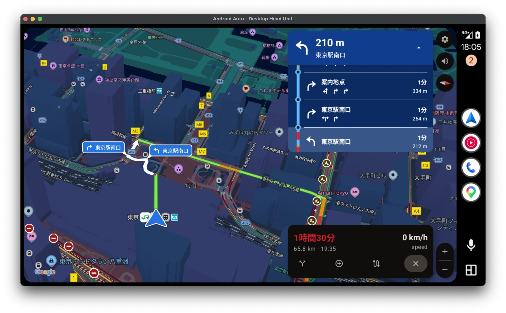
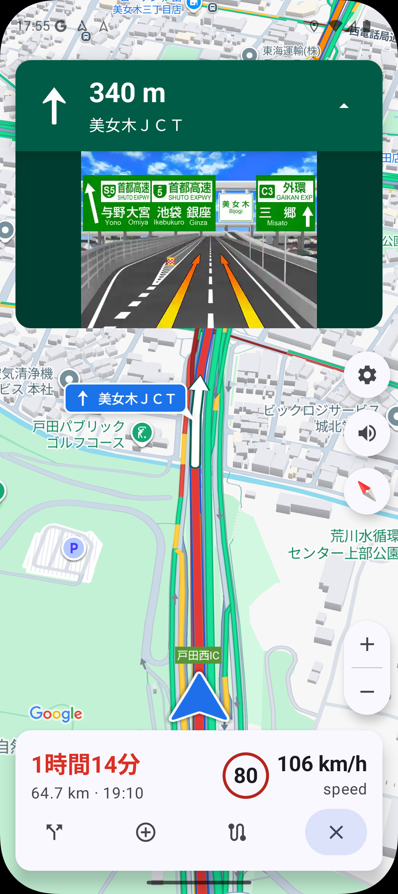
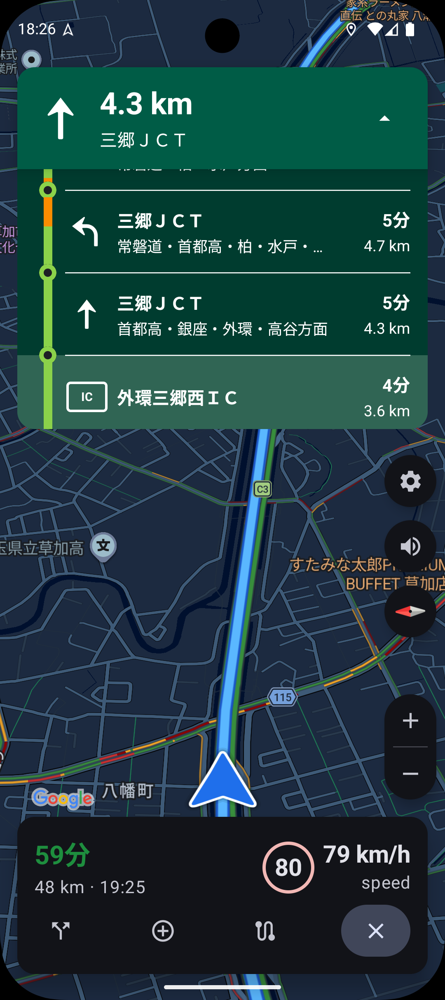
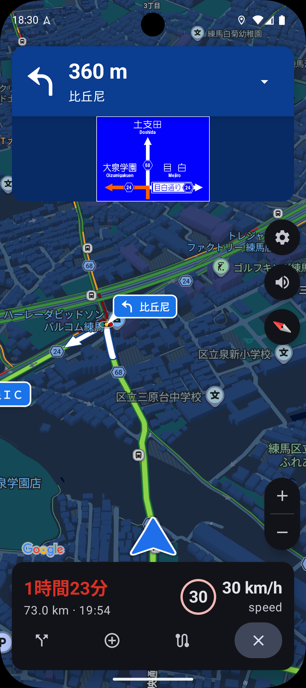
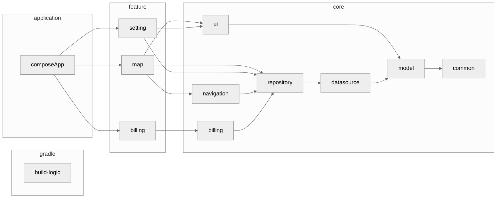

<h1 align="center">OneNavi</h1>

<p align="center">
OneNavi は美しい UI と実用的なインターフェースを併せ持つ、<br>
<a href="https://github.com/matsumo0922">@matsumo0922</a> のポートフォリオナビアプリケーションです。
</p>

<div align="center">
  <a href="./LICENSE">
    
  </a>
  <a href="">
    
  </a>
  <a href="">
    
  </a>
  <a href="https://open.vscode.dev/matsumo0922/OneNavi">
    
  </a>
</div>

<hr>

<table align="center">
  <tr>
    <td align="center"></td>
    <td align="center"></td>
  </tr>
  <tr>
    <td align="center"><b>Android Auto — Light</b></td>
    <td align="center"><b>Android Auto — Dark</b></td>
  </tr>
</table>

## Status

#### 開発中 / ポートフォリオ :construction:

このリポジトリは、個人開発のカーナビアプリとして培った設計・実装を公開する **ポートフォリオ**
です。地図描画・状態管理・音声案内・Android Auto 対応・開発ツールといった「アプリ側」の
工夫を読めるように整理しています。

経路探索・turn-by-turn 案内のコアロジックは、別管理の **private なライブラリ
`ext-api`** に委譲しています。このライブラリは非公開のため、現状では
**本リポジトリ単体ではビルドできません**。あらかじめご了承ください。

現在は、`ext-api` の **interface 互換を保ったまま Google Maps SDK / Google
Routes API のみで経路案内が動く構成** を開発中です。これが完成すれば、private ライブラリに
依存せず本リポジトリ単体でビルド・実行できるようになる予定です。アーキテクチャは当初から
「地図 provider」と「案内 provider」を疎結合に分離しているため、案内データ源の差し替えを
前提とした設計になっています（詳しくは [Architecture](#architecture) を参照）。

## Why?

スマートフォンの地図アプリは地図表現や検索体験に優れる一方で、日本のカーナビとして見ると
音声案内・レーン案内・高速道路のパネル表示といった「運転中に効く情報」には物足りなさが
あります。逆に、案内品質を強みとするアプリは Android Auto 対応や UI/UX の面で古さが残る
ことがあります。

OneNavi は、この **「美しく扱いやすい地図体験」と「実用的で高品質な案内情報」を一つに
まとめる** ことを目的に開発しました。

- **地図描画は Google Maps SDK** に任せ、滑らかな地図・カメラ・オーバーレイ表現を得る
- **案内情報は `ext-api`** から受け取り、日本のカーナビに必要なレーン・方面
  看板・規制・渋滞・信号案内を扱う
- **自車位置の投影・進捗追跡・音声発話・リルート判定はすべてアプリ側で自前実装** し、
  案内データ源に依存しない安定した turn-by-turn 体験を組み立てる

Google マップなどから intent share で起動し、目的地への案内だけに集中する。運転中に本当に
必要な情報を、見やすく・正しいタイミングで届けることを目指しています。

<table align="center">
  <tr>
    <td align="center"></td>
    <td align="center"></td>
    <td align="center"></td>
  </tr>
  <tr>
    <td align="center"><b>高速道路のレーン案内</b></td>
    <td align="center"><b>IC / JCT のパネル表示</b></td>
    <td align="center"><b>一般道の交差点案内</b></td>
  </tr>
</table>

## Tech Stack

- [Kotlin](https://kotlinlang.org/) / [Coroutines](https://kotlinlang.org/docs/coroutines-overview.html) / [Flow](https://kotlinlang.org/docs/flow.html)
- [Kotlin Multiplatform](https://www.jetbrains.com/ja-jp/kotlin-multiplatform/)
- [Jetpack Compose Multiplatform](https://www.jetbrains.com/ja-jp/lp/compose-multiplatform/) / [Material3](https://m3.material.io)
- [Navigation3](https://developer.android.com/guide/navigation)
- [Koin](https://insert-koin.io/)（DI）
- [Ktor](https://ktor.io/) / [kotlinx.serialization](https://github.com/Kotlin/kotlinx.serialization)
- [kotlinx.collections.immutable](https://github.com/Kotlin/kotlinx.collections.immutable)
- [Google Maps SDK](https://developers.google.com/maps) / [Google Routes API](https://developers.google.com/maps/documentation/routes)
- [Android for Cars App Library](https://developer.android.com/training/cars)（Android Auto）
- [Google Cloud Text-to-Speech](https://cloud.google.com/text-to-speech)（Chirp 3 HD）
- Gradle 9 + AGP 8 + Convention Plugins（`build-logic`） / [detekt](https://detekt.dev/) + Twitter Compose Rules

## Feature

#### 対応済み

- **経路案内**
  - Google マップなどから intent share で起動し、ワンタップで経路案内を開始。
  - 自前実装の turn-by-turn 案内（自車位置の polyline 投影・進捗追跡・到着判定）。
  - GPS のブレや一時的なオフルートに強い、ヒステリシス付きのリルート検知。
- **高速道路 / 一般道に最適化した案内表示**
  - 高速道路のレーン案内・方面看板の描画。
  - IC / JCT / SA / PA の通過順・距離・所要時間を並べたパネル表示。
  - 一般道の交差点拡大図・方面案内。
  - 渋滞・規制・事故などのオーバーレイ表示と CallOut。
  - 制限速度・現在速度の表示。
- **音声案内**
  - Google Cloud TTS Chirp 3 HD による自然な日本語の turn-by-turn 音声。
  - 効果音 / AudioFocus 制御 / 割り込み（FLUSH）再生。
- **Android Auto**
  - 車載ディスプレイへの Google Maps 描画と経路案内（VirtualDisplay + Presentation 方式）。
  - ライトモード / ダークモードの自動切り替え。
- **走行支援**
  - トンネルなど GPS 途絶区間での推測航法（dead reckoning）。

#### 開発中

- `ext-api` への依存を外し、Google Maps SDK / Google Routes API のみで
  動作する構成（本リポジトリ単体でのビルドを可能にする）。

## Architecture

OneNavi は **feature → core（repository → datasource → model）** のレイヤー構成を取り、
DI は Koin、ビルドロジックは Convention Plugins（`build-logic`）で標準化しています。
全体像をつかみやすくするため、一部のモジュールと依存関係は省略しています。



### 地図 provider と案内 provider の分離

カーナビの中核は「地図を描く」責務と「どこをどう曲がるかを決める」責務に分かれます。
OneNavi はこの 2 つを明確に分離しました。

- **地図描画**は Google Maps SDK が担当（カメラ・polyline・マーカー・オーバーレイ）。
- **案内情報**は `ext-api` から受け取り、外部API 連携レイヤーでアプリの
  ドメインモデルに変換。**provider 固有の型を UI state に持ち込まない**ことを徹底。

この分離により、案内データ源を Google Routes API ベースの実装へ差し替える、といった
provider 入れ替えが現実的になっています（現在まさに開発中の構成）。

### turn-by-turn 案内の自前実装

外部の Navigation SDK に案内そのものを任せると、ルート形状が SDK 側で補正され、案内データ
源の polyline と挙動が一致しない問題がありました。そこで **進捗計算・発話・リルートを
すべてアプリ側で実装** しています。

- **自車位置の投影** — `FusedLocationProviderClient` の生 GPS を polyline の最近接
  セグメントへ投影。進捗が単調増加するよう前 tick より手前は探索せず、ヒステリシスで
  jitter を吸収。
- **距離基準の一元化** — 案内データの「残距離」とアプリ側の polyline 累積距離は完全には
  一致しないため、始点・終点・中間アンカーで線形変換するマッパーを用意し、発話タイミングや
  次の maneuver 検索を二分探索で安定化。
- **GPS tick の集約** — 位置更新・進捗・リルート判定・音声・交通オーバーレイなど複数の
  消費者が同じ snapshot を参照する、単一の窓口（tracker）に正規化。
- **リルート検知** — 1 tick の候補判定と複数 tick の debounce を分離し、GPS 精度・投影
  誤差・速度・進行方向差から誤検知と再探索コストを抑制。

### 音声案内パイプライン

- Google Cloud TTS（Chirp 3 HD）を Ktor の REST で叩き、**LINEAR16 / 24kHz の PCM を
  `AudioTrack` で直接再生**。MP3 デコード待ちを避けて低レイテンシ化。
- **発話予約キューと再生 job を分離** し、割り込み（FLUSH）が安全に現在の発話を cancel
  できる構造に。
- **段階的フォールバック** — 恒久エラー（401/403）はセッション無効化、連続失敗は
  クールダウンで切り分け。同一文言は LRU キャッシュで通信量とレイテンシを削減。
- **AudioFocus** を request / abandon の 1:1 で管理し、duck 状態の取りこぼしを防止。

### Android Auto（VirtualDisplay + Presentation）

Android Auto の第三者アプリには、安全性のため Template ベースの UI しか基本的に許されません。
リッチな Google Maps をそのまま車載ディスプレイへ出すには、公開 API の範囲で工夫が必要でした。

- `AppManager.setSurfaceCallback()` で受け取る **app-owned Surface** に対し、
  `DisplayManager.createVirtualDisplay()` → `Presentation` を仲介層として挟み、
  Google Maps の `MapView` と Compose オーバーレイを attach する **VirtualDisplay +
  Presentation 方式** を採用（Google 公式の Navigation SDK と同じ構成）。
- `Presentation` の decorView には `ViewTree*Owner` が自動で付かないため、Session の
  Lifecycle をぶら下げた owner を手動注入（これを怠ると初回 Compose 描画で即クラッシュ）。
- host からは MotionEvent ではなく semantic callback（onClick / onScroll / onFling /
  onScale）しか届かないため、**MotionEvent へ組み立て直す入力変換層** を実装。
- `SurfaceControlViewHost` などの代替手段や、`visibleArea` と実 Surface サイズのズレ
  （density / observedFrame 問題）、producer/consumer の frame pacing による入力遅延まで
  実機・DHU で検証し、公開 API の範囲で最善の構成に落とし込みました。

> 検証の過程は `docs/spec/14_android_auto_google_maps_investigation.md` と
> `docs/logs/` の Android Auto 関連ログに残しています。

### 推測航法（Dead Reckoning）

トンネルなど GPS が途絶える区間では、自車マーカーが止まってしまうと案内体験が大きく劣化
します。OneNavi では案内中の自車位置を `VehicleLocationState`（route-snapped）に一元化し、
GPS 途絶中はフレームごとの推定 pose で滑らかに補間。古い lastKnown 位置・粗い初期 fix・
遠距離 jump をヒステリシスで吸収します。

## Dev Tools

本番モジュールには統合されない、デバッグ用の独立した mini app です。
開発のフィードバックループを短くするために自作しました（`make dev-tools` で起動）。

| ツール | 用途 |
|---|---|
| `dev-tools` | Emulator の gRPC `setGps` 経由で bearing / speed / satellites まで含めた GPS を注入し、**ルート走行をエミュレータ上でシミュレーション**。`adb emu geo fix` では bearing が固定されてしまう問題を回避。 |

## Contribute

このアプリはビルドロジックの標準化に Gradle の Convention Plugins を採用しており、その
ロジックは `build-logic` モジュールにまとめています。この手法については
[nowinandroid](https://github.com/android/nowinandroid/tree/main/build-logic) を参照
してください。

前述のとおり、経路案内のコアロジックは private な `ext-api` に依存している
ため、現状では外部からのビルドはできません。Google Maps SDK / Google Routes API のみで
動作する構成が完成し次第、ビルド手順を整備する予定です。

## License

```text
OneNavi
Copyright 2026 daichi-matsumoto

Licensed under the Apache License, Version 2.0 (the "License");
you may not use this file except in compliance with the License.
You may obtain a copy of the License at

https://www.apache.org/licenses/LICENSE-2.0

Unless required by applicable law or agreed to in writing, software
distributed under the License is distributed on an "AS IS" BASIS,
WITHOUT WARRANTIES OR CONDITIONS OF ANY KIND, either express or implied.
See the License for the specific language governing permissions and
limitations under the License.
```
